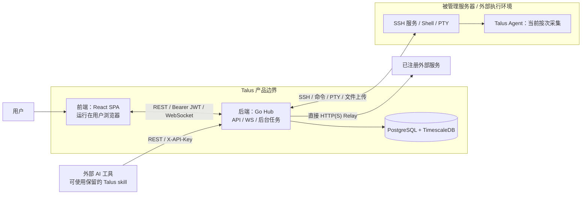
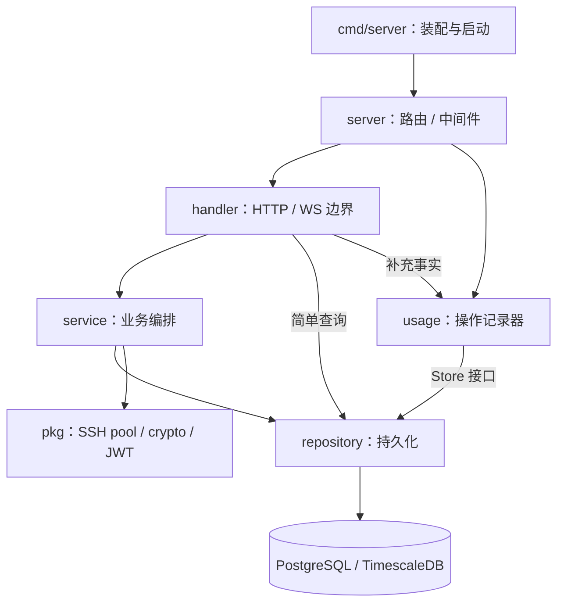
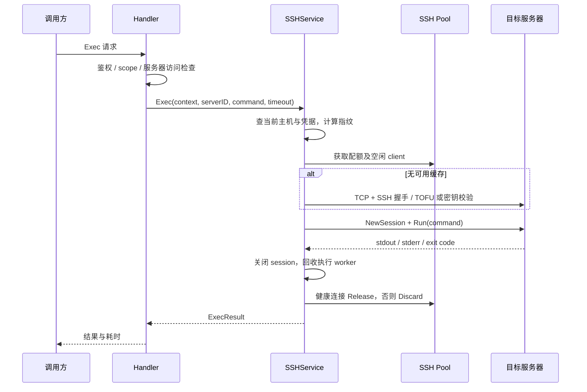
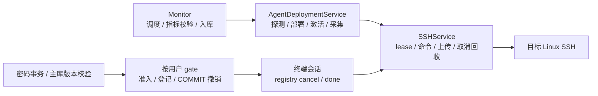

# Talus 架构设计：当前实现与演进方案

> 初次分析：2026-10-08；修订日期：2026-10-09；代码基线：`21d53b4`（`work` 分支）。
> 本文依据当前仓库源码、依赖声明、部署配置和测试资产整理。未连接实际数据库或目标服务器，未执行项目测试、构建或性能压测。文中的"已确认"指源码中可直接确认的实现；并发竞态、线上性能和运维配置另外标注。
> 本次仅更新文档。第 2–9 节以当前实现为主，另有明确标注的目标说明；第 10–12 节记录问题与实施安排，第 13 节汇总演进目标及新增契约。所有实施范围与验收条件见 [需求文档](REQUIREMENTS.zh-CN.md)。目标能力尚未实现；本次补充的时间/容量数值为设计基线，未完成运行测量。

## 1. 架构结论

Talus 是面向少量 Linux 服务器、自托管、单用户场景的管理平台。整体采用 **React SPA + Go 模块化单体 Hub + PostgreSQL/TimescaleDB**。Hub 主动通过 SSH 执行命令、提供交互终端和采集指标；服务代理由 Hub 直接发起 HTTP 请求；AI 工具通过同一 REST API 接入。

**Hub 就是 Go 后端服务**，包含 HTTP/WS 接口和后台任务；数据库是独立组件。React 前端运行在浏览器，生产环境中的前端静态文件由 Hub 提供。同一镜像打包前后端产物，并不意味着 React 页面在后端进程中执行。

现有架构与产品规模相匹配：部署组件少，后端职责分层明确，前端按业务功能组织，SSH、加密、鉴权和日志有独立基础模块。建议继续沿用这一结构，优先完善资源生命周期、超时预算、监控数据正确性和跨页面缓存一致性，再按实际规模演进。

最值得先处理的事项：

1. Agent 上传路径 `CopyFile` 未归还 SSH 连接池配额，且上传执行缺少超时和取消回收。
2. HTTP 写超时 15 秒，与 Exec 默认 30 秒、最长 300 秒及 Relay 30 秒不一致。
3. 监控 Agent 的目标架构、版本更新和采集任务生命周期尚未统一管理。
4. README 对 SSH 隧道、远端文件清理和秘密返回边界的描述与实现存在偏差。
5. 前端服务器变更未同步失效 Dashboard 缓存，部分请求取消未贯通到 HTTP。

本次已确认的方向还包括：保留 `skills/talus/`、移除平台适配器；基于现有采集数据参考 Beszel 完善图表尺度与交互；继续使用 xterm 优化终端；改密码撤销旧 JWT 和对应终端会话；统一英文测试用例说明与执行入口。页面采集频率配置和秒级采集需求已取消，具体范围见 `REQ-04`。

## 2. 技术栈与运行组件

| 层次 | 当前技术 | 作用 |
| --- | --- | --- |
| 前端 | React 19、TypeScript 6、Vite 8、React Router 7 | 页面、路由、构建和懒加载 |
| 样式与表单 | Tailwind CSS 4、React Hook Form、Zod | UI、表单和运行时响应校验 |
| 交互终端 | xterm.js、FitAddon、WebLinksAddon | 浏览器 PTY 展示、尺寸同步 |
| 后端 | Go 1.25、Chi v5 | HTTP/WS 服务和业务编排 |
| 数据访问 | GORM、pgx、PostgreSQL 16 | 关系数据、事务及 SQL 查询 |
| 时序数据 | TimescaleDB | metrics hypertable、时间桶聚合 |
| 安全与连接 | golang-jwt、bcrypt、AES-GCM、Argon2id、Go SSH、Gorilla WebSocket | 认证、秘密存储、远程操作 |
| 采集程序 | Go CLI + gopsutil | 在目标主机运行一次，输出指标 JSON 后退出 |
| 部署与质量 | Docker Compose、GitHub Actions、CodeQL、Playwright、oxlint | 构建、发布和回归检查 |

版本依据：[backend/go.mod](../backend/go.mod)、[frontend/package.json](../frontend/package.json)。依赖声明中的 `^`/`~` 是版本范围，前端实际安装版本由 lockfile 决定。

### 2.1 系统边界



- 图中产品边界包含前端、Hub 和数据库，目标服务器及外部服务属于外部依赖；Agent 是 Talus 提供但部署到外部主机的程序。
- Compose 默认只有 `hub` 与 `db` 两个常驻容器；前端产物由 Hub 提供，加载后由浏览器执行。运行部署时需分别考虑浏览器、Hub 和目标服务器的位置。
- 目标服务器不需要向 Hub 回连或开放新的采集端口，Hub 必须能访问其 SSH。
- Agent 进程是按次运行的，上传的二进制会留在目标服务器 `/tmp/vpsmanager-agent` 供后续复用。
- Relay 的 `base_url` 必须从 **Hub 所在网络**可达。`Service.ServerID` 是关联和过滤属性，当前没有建立 SSH 隧道。
- 外部 AI 工具可通过保留的 skill 调用 API，没有独立 MCP 服务端组件。平台适配器当前仍在工作树中，按本次确认需求待移除；它们不作为目标架构中的运行组件。

依据：[docker-compose.yml](../docker-compose.yml)、[monitor.go](../backend/internal/service/monitor.go) 第 16、155 行、[service_relay.go](../backend/internal/service/service_relay.go) 第 38、272 行。

## 3. 目录结构与模块职责

```text
Talus/
├── backend/
│   ├── cmd/server/             Hub 启动入口、依赖装配、迁移与生命周期
│   ├── cmd/agent/              一次性远端指标采集程序
│   └── internal/
│       ├── config/             环境变量配置
│       ├── server/             路由、响应、错误、中间件
│       ├── handler/            HTTP/WS 参数、权限、操作事实和响应
│       ├── service/            业务编排、SSH、终端、监控和 Relay
│       ├── repository/         GORM/SQL、事务、迁移和历史回填
│       ├── model/              持久化模型及部分响应结构
│       ├── usage/              操作状态、记录器、重试和实例租约
│       └── pkg/                crypto、token、sshpool
│   # 各业务包的 *_test.go 与源码同目录：Go 单元/仓储/协议测试
├── frontend/
│   ├── src/app/                Provider 与路由
│   ├── src/features/           auth、servers、credentials、dashboard、
│   │                           monitoring、terminal、services、usage-logs
│   ├── src/components/         共享布局和 UI 基础组件
│   ├── src/lib/                API、query、auth、错误、秘密加载等
│   ├── src/hooks/              共享 hook
│   ├── src/types/              API 类型、模型和 schema
│   ├── src/i18n/               轻量翻译 store 与中英文词条
│   └── tests/                  Node 回归测试与 Playwright 浏览器测试
├── ai-integration/             当前存在，计划删除的平台适配器及安装器
├── skills/talus/               保留：对外 API 操作 skill
├── docs/                       项目文档（README.zh-CN.md + ARCHITECTURE/REQUIREMENTS/IMPLEMENTATION/DEVELOPMENT-PLAN）
├── Dockerfile                  Hub、Agent、前端多阶段构建
└── .github/workflows/          CI、镜像发布与 CodeQL
```

## 4. 后端架构

### 4.1 分层与依赖



这是按职责分层的单体，并未严格隔离领域模型和传输模型：

- 通常为 `Handler → Service → Repository`，main 手工注入依赖，没有 DI 容器。
- Metrics 和 Usage 查询 Handler 直接使用 Repository；对简单查询，这个选择可以保持。
- `model` 同时包含 GORM 映射、JSON 标签和展示字段，例如 Server 的在线状态和最新指标。
- 部分 Service 导入 `server` 错误与 `server/middleware` 权限工具，业务层与 HTTP 层存在反向耦合。
- Usage Recorder 已使用 Store 接口；其他模块大多直接依赖具体 Repository/Service。

入口：[main.go](../backend/cmd/server/main.go) 第 148 行；边界例外：[metrics.go](../backend/internal/handler/metrics.go) 第 14 行；反向耦合：[apikey.go](../backend/internal/service/apikey.go)。

### 4.2 启动和退出

启动顺序为：读取配置 → 初始化 slog/JWT/Master Key → 连接数据库 → 执行兼容 DDL 与 AutoMigrate → 创建 metrics hypertable → 装配各模块 → 启动 Usage、API Key 所属用户回填、Monitor → 监听 HTTP。

数据库初始化包含创建 TimescaleDB 扩展、删除旧字段、重命名约束、历史 API Key schema 准备、模型迁移、scope 回填。`metrics` 按 `time` 建 hypertable，chunk 为一天。数据库连接池默认上限 32，配置值小于 12 时提升至 12。

退出时等待 SIGINT/SIGTERM，执行最多 30 秒 HTTP Shutdown；SSH pool 和 Usage Recorder 通过 defer 清理。Monitor 使用 `context.Background()`，没有 cancel/join。HTTP Shutdown 也不会自动关闭已劫持的 WebSocket 连接，因此后台任务与终端仍需要统一生命周期管理。

依据：[main.go](../backend/cmd/server/main.go) 第 28、58、141、287、352、369 行、[config.go](../backend/internal/config/config.go) 第 65 行。

### 4.3 请求与权限边界

```text
全局：RequestID → Logger → Recoverer → CORS → 路由
受保护接口：UsageCapture → Auth → Handler → Service/Repository
```

Usage 位于 Auth 外层，能观察被拒绝的操作请求；只有登记的操作路由会生成 Usage 记录，普通列表查询和登录并非完整记录范围。

| 接口组 | 示例 | 鉴权与能力边界 |
| --- | --- | --- |
| 公共接口 | `/healthz`、`/api/v1/version`、`/auth/login`、`/auth/setup` | 登录/初始化检查有按 IP 限流 |
| 服务器 | `/servers`、`/servers/summary`、`/servers/{id}` | API Key 使用 `servers:read/write`；删除为 JWT-only |
| 远程命令 | `POST /servers/{id}/exec` | `servers:exec` + 服务器访问范围 |
| 终端 | `GET /servers/{id}/terminal` | API Key 握手鉴权；浏览器 WS 首帧 JWT |
| 指标 | `GET /servers/{id}/metrics` | `metrics:read` + 服务器访问范围 |
| SSH 凭据 | `/credentials`、`/{id}/reveal` | Key 可读取元数据；修改、删除、秘密 reveal 为 JWT-only |
| API Key 管理 | `/api-keys`、`/{id}/reveal` | JWT-only；reveal 限流 |
| 服务 | `/services`、`/{id}/relay`、`/{id}/credentials` | `services:read/relay`；管理和秘密读取为 JWT-only |
| Usage 日志 | `/usage-logs`、`/filter-options`、`/{id}` | 额外要求 JWT admin，API Key 无权查询 |

表中业务接口均以 `/api/v1` 为前缀。"JWT-only"表示拒绝 API Key，不等价于已实现统一多角色 RBAC。

HTTP 优先验证 `X-API-Key`，否则验证 Bearer JWT。Key 的授权包含动作 scope 和 `ServerIDs` 范围；空范围表示全部服务器。首次管理员创建已使用 PostgreSQL 事务 advisory lock，避免并发初始化多个首用户。

JSON 成功响应通常为 `{"data": ...}`，错误为包含 `code/reason/message/request_id` 的 envelope；Relay 成功响应和 WebSocket 使用各自协议。稳定的 `reason` 供前端映射提示，Request ID 用于关联排查。

依据：[router.go](../backend/internal/server/router.go) 第 84、112 行、[scope.go](../backend/internal/server/middleware/scope.go) 第 10、27、150 行、[auth.go](../backend/internal/server/middleware/auth.go) 第 60 行、[usage_log.go](../backend/internal/handler/usage_log.go) 第 74 行、[response.go](../backend/internal/server/response.go)。

## 5. 前端架构

### 5.1 页面与数据链路

入口是 `main.tsx → Providers → AppRouter`。Providers 提供 BrowserRouter 与 Toaster；登录/初始化页面同步加载，其余功能页通过 React.lazy 加载。根错误边界和页面错误边界负责恢复，静态资源缓存策略及版本提示用于处理更新后的旧 chunk。

常规 feature 的依赖顺序为：

```text
components → hooks → 自研 query → feature/api.ts → apiClient → 后端
                         ↑                          ↑
                    会话变化清理               auth store / Bearer JWT
```

`apiClient` 统一请求、响应 envelope、401/403 和错误处理，业务 API 使用 Zod 校验响应。表单采用 React Hook Form + Zod；共享 UI 由项目内组件实现。

### 5.2 状态和缓存

前端主要采用 React 局部状态和自研 store，没有 Redux/Zustand、TanStack Query 或 i18next 依赖：

- **Query**：模块级 Map，数组 queryKey；请求去重、默认 30 秒 stale time、默认重试一次、前缀失效、AbortController 和 generation 防迟到写入，并提供缓存修剪能力。
- **Auth**：JWT 存 localStorage；解析用户和过期时间以维护 UI 状态，真实认证仍在后端。使用 `authEpoch` 区分会话，支持过期清理及跨标签同步；旧请求的 401 不会清除新会话。
- **日志权限**：独立 `usagePermissionRevision`，日志被拒绝时只清理相关权限和缓存。
- **秘密**：`useSecret` 单独按需加载、保存在组件局部状态，卸载取消；不放进共享 Query 缓存。
- **i18n/主题**：轻量模块 store 与 hook；中英文词条独立存储。

自研基础设施降低依赖和包体积，也意味着缓存失效、并发、会话隔离和取消语义由项目自身维护。已有专门回归测试，应继续把这些行为视为基础协议。

依据：[query.ts](../frontend/src/lib/query.ts) 第 62、109、155、188、202 行、[auth.ts](../frontend/src/lib/auth.ts) 第 39、92、124 行、[api-client.ts](../frontend/src/lib/api-client.ts) 第 58 行、[use-secret.ts](../frontend/src/lib/use-secret.ts)。

### 5.3 监控、终端与日志页面

| 功能 | 客户端设计 |
| --- | --- |
| Dashboard | 独立 `dashboard` 缓存；默认每 60 秒刷新 |
| Monitoring | 按 server/timeRange 查询；页面可见时每分钟刷新；按时间桶补齐 null，用 SVG 断线显示缺失采样 |
| Terminal | xterm + WebSocket；首帧发送 JWT，token 不放 URL；resize 防抖、最多五次退避重连、卸载清理 |
| Usage Logs | 固定查询时间窗、签名游标分页、URL 过滤条件与详情；ID 用十进制字符串避免 bigint 精度损失 |

日志页有独立的查询会话：最多缓存 20 页、保留 100 页游标历史、50 条详情、10 分钟闲置 TTL；页成员变化时撤销后续游标；可选更新探针和 running 详情轮询与页面可见性及权限 epoch 联动。这比普通 CRUD 缓存复杂，不宜直接合并为普通无限列表。

依据：[use-dashboard.ts](../frontend/src/features/dashboard/hooks/use-dashboard.ts)、[use-metrics.ts](../frontend/src/features/monitoring/hooks/use-metrics.ts)、[use-terminal.ts](../frontend/src/features/terminal/hooks/use-terminal.ts)、[session.ts](../frontend/src/features/usage-logs/lib/session.ts) 第 4、83、132 行。

## 6. 关键业务流程

### 6.1 SSH 执行与连接池



连接池按服务器 ID 限制并发，main 固定为每台 **3 个借用配额**。每个条目只缓存一个空闲 client；连接借出后由调用者独占，并发请求可能新建其他连接。因此"3"不是三个常驻缓存连接，也不是在一条共享连接上多路复用所有业务。

等待配额和拨号默认 10 秒，缓存空闲期默认 300 秒，清理周期 30 秒；缓存命中会做有界 keepalive。指纹包含 host、port、credential ID 和更新时间，服务器或凭据变更会触发失效。

Exec 的业务 timeout 在取得 client 后开始，不包含此前数据库、配额等待和拨号。非零退出码可作为正常传输结果返回；取消时先关闭 session，必要时关闭独占 transport，回收 worker 后才读取输出和归还资源。stdout/stderr 当前完整缓存在内存，尚无字节上限。

依据：[pool.go](../backend/internal/pkg/sshpool/pool.go) 第 38、84、197、226 行、[ssh.go](../backend/internal/service/ssh.go) 第 60、92、194、213 行、[dial.go](../backend/internal/pkg/sshpool/dial.go)。

### 6.2 监控采集

默认每 60 秒查询所有服务器，为每台启动一个 goroutine，执行 `/tmp/vpsmanager-agent --format json`，解析 JSON 后写入 metrics。首次采集在 ticker 第一次触发时发生。

Agent 缺失时，Hub 将本地 `/usr/local/bin/vpsmanager-agent` 上传至目标固定路径，再执行一次。Agent 使用 gopsutil 采集 CPU、内存、磁盘、负载、Swap、网络及磁盘累计 I/O、系统和 uptime；CPU 采样约一秒，进程完成输出即退出。

采集按整批 `WaitGroup.Wait()` 等待，当前无全局 worker 上限。metrics 时间戳采用 Hub 入库时的 UTC 时间；查询使用 Timescale `time_bucket` 聚合，默认将 1h/6h/24h/更长窗口映射为 1m/5m/15m/1h 桶。

服务器在线状态根据最新 metrics 是否在 120 秒内判断，反映采集新鲜度；不是独立的实时 SSH 探活结果。

依据：[monitor.go](../backend/internal/service/monitor.go) 第 99、117、155 行、[agent/main.go](../backend/cmd/agent/main.go)、[metric.go](../backend/internal/repository/metric.go) 第 45、198 行、[metrics.go](../backend/internal/handler/metrics.go) 第 109 行、[server.go](../backend/internal/service/server.go) 第 36 行。

### 6.3 交互终端

浏览器 WS 握手只在精确终端路由允许推迟认证；首条消息必须在 10 秒内提交 JWT。带 `X-API-Key` 的程序客户端在 HTTP 握手阶段已经验证 scope。认证和服务器访问检查通过后，创建 SSH PTY/Shell，分别转发输出与输入/resize。

输出逐块转发（4 KiB），有背压；会话结束时关闭 WS/session，必要时关闭 transport 并等待 pump 退出。认证后读 deadline 被清除，当前没有消息大小上限、应用心跳或空闲超时。长时间闲置或半断开会话可能继续占用 SSH 配额。

依据：[handler/terminal.go](../backend/internal/handler/terminal.go) 第 19、25、78 行、[service/terminal.go](../backend/internal/service/terminal.go) 第 55、125、147 行。

### 6.4 服务 Relay 与保留的 skill

Relay 流程：查服务配置 → 解密凭据 → 拼接 `base_url/path/query` → 替换 URL/header/body 中的 `{{key}}` → 使用普通 `http.Client.Do` → 转发响应。认证头由调用方按 `usage_guide` 提供，例如在 Authorization 中引用 `{{token}}`；Hub 不会自动补充默认认证头。

HTTP client 总 timeout 固定 30 秒，禁止自动重定向；过滤 hop-by-hop 响应头，拒绝 101 Upgrade。响应以 32 KiB buffer 流式转发并 flush，请求 body 则先缓存在内存。因此当前支持有限时长的 HTTP 代理，长 SSE/下载需要重新设计 timeout；不能视为通用 WS 或无限时长流式代理。

保留的 skill 使用 `GET /services` 发现目录 → `GET /services/{id}` 读取完整 `usage_guide` → `POST /services/{id}/relay` 调用。移除平台适配器后，发现与读取指南继续由 skill 驱动；保留 REST API、API Key、服务 Relay 和 `usage_guide`。适配器安装、自动注入和缓存说明将随清理移除，不新增替代 hook。

依据：[service_relay.go](../backend/internal/service/service_relay.go) 第 35、272、349 行、[Talus skill](../skills/talus/SKILL.md)。

## 7. 数据与秘密管理

### 7.1 核心数据模型

| 表/模型 | 职责与关系 |
| --- | --- |
| users / User | 用户名、bcrypt 密码摘要、Role；首次登录创建 admin |
| ssh_credentials / SSHCredential | SSH 用户名、认证方式、加密密码/私钥及 salt；旧 server_id 已弃用 |
| servers / Server | 主机信息、OwnerID、CredentialID、固定/观测 Host Key 与 mismatch 状态 |
| api_keys / APIKey | KeyHash、加密原始 key、scope、ServerIDs、UserID 与 owner_binding_version（历史 Key 所属用户绑定回填标记） |
| services / Service | 可选 ServerID、BaseURL、加密凭据、说明与 usage_guide |
| metrics / Metric | ServerID、time 和 nullable 指标；hypertable，无 BaseModel |
| audit_events / AuditEvent | 敏感操作审计；可用唯一 OperationID 关联操作 |
| usage_logs / UsageLog | 操作事实、状态序号、身份与资源快照、保留时间 |
| usage_log_instances | Recorder 实例租约、心跳和退休状态 |
| usage_log_backfill_states | 旧 Audit → Usage 回填检查点 |

逻辑关系是 `User → Server/APIKey`、`SSHCredential ← 多个 Server`、`Server → Metric/Service`、`Operation → Usage/Audit`。这描述代码中的 ID 关联，**不代表已经核验生产数据库的所有外键**。Usage 使用历史快照，避免资源或身份删除后丢失可读信息。

多数基础业务模型采用 BaseModel 时间戳和软删除；API Key、Metric、Usage 有各自生命周期，不能统一按软删除理解。依据：[model](../backend/internal/model)。

`APIKey.OwnerBindingVersion` 是历史 Key 所有权绑定迁移的标记，不参与认证版本检查；它与目标 `users.token_version`（JWT 撤销版本）是两个独立概念。改密码不递增该 Key 迁移标记，也不据其撤销 API Key 会话。

### 7.2 秘密与会话

SSH 秘密、服务凭据、可复制 API Key 原文以 AES-256-GCM 加密；使用每记录随机 salt，由 Master Key 经 Argon2id 派生 AES key。API Key 请求校验使用 SHA-256 hash。列表和普通读取排除加密字段和 salt；已有秘密通过专用 reveal/credentials 接口按需返回，并限流、记录审计。另一个明确例外是 API Key 创建响应会返回新 key 原文，该创建接口不使用 reveal 限流器。

JWT 默认有效 24 小时，属于无状态会话；改密码只更新密码摘要，已签发 JWT 不会立即失效。主机密钥采用首次使用信任（TOFU），变化时拒绝连接，等待操作员显式信任新密钥。

这一 JWT 行为由“签名与密码摘要独立，验证时不检查会话版本”造成；无状态实现减少了会话管理，但源码没有记录明确的产品理由。**目标设计**是用户级 `token_version`：改密码事务中更新摘要并递增版本，COMMIT 为撤销线性化点；单 Hub 用户 gate 串行协调 HTTP 准入、终端准备期登记、ready/输入许可与撤销。首期版本检查每次查主库，禁用正向版本缓存；gate 等待和版本查询合计最多 2 秒，存储不可用/提交未决时拒绝准入。提交后同步标记旧 JWT 会话 revoked/cancel，以本地确认 COMMIT 成功为计时起点，在锁外总计 3 秒内关闭 WS/SSH 并回收 lease/worker。API Key 独立管理，改密码不自动删除或撤销 Key。该保证限定单 Hub，完整终端验收依赖 `REQ-06/07`；注册竞态、未决提交核实/重启和预算详见 `REQ-05`。

依据：[crypto/key.go](../backend/internal/pkg/crypto/key.go)、[crypto/aes.go](../backend/internal/pkg/crypto/aes.go)、[token/jwt.go](../backend/internal/pkg/token/jwt.go)、[auth.go](../backend/internal/service/auth.go) 第 132 行、[ssh.go](../backend/internal/service/ssh.go) 第 143 行。

## 8. Usage 与审计可靠性

Usage 不是简单的"请求结束插入一行"：

- 操作使用 OperationID、Phase、StateSeq、Outcome，身份与资源保存快照；Exec、Relay、Terminal 记录长操作阶段。
- Recorder 对 active、重试条数/字节/时间、写入并发和 DB 连接预算设上限；审计、心跳、维护有独立容量。
- 默认写入 timeout 200 ms、普通重试窗口两分钟；实例每 10 秒心跳，默认 lease 一分钟，用于恢复失联的 running 操作。
- Repository 通过 OperationID 去重、状态序号及事务锁保护更新；异常恢复以 unknown 表示缺少确定终态，避免伪造成功。
- 普通 Usage 默认保留 30 天，reveal/trust/delete 等敏感操作默认 90 天；历史 Audit 回填有锁、批次和检查点，需要确认旧 writer 排空后启用。
- 查询使用签名且绑定用户/过滤条件的游标与 keyset；客户端固定时间窗口。

当前语义是 **best-effort，优先保持业务响应，不保证零丢失**。仓库已有容量控制、失败统计和恢复机制；只有产品要求不可丢失审计时，才需要引入事务 outbox 或持久化重试队列。

依据：[recorder.go](../backend/internal/usage/recorder.go) 第 47、73、177 行、[usage_policy.go](../backend/internal/model/usage_policy.go)、[repository/usage_log.go](../backend/internal/repository/usage_log.go)、[middleware/usage.go](../backend/internal/server/middleware/usage.go) 第 61 行。

## 9. 构建、部署与验证资产

- 多阶段 Dockerfile 分别构建 Hub/Agent 与前端，最终 Alpine 镜像以非 root 用户运行 Hub，静态目录为 `/static`。
- Agent 随 Hub 的 `TARGETOS/TARGETARCH` 编译。CI 发布 amd64/arm64 两种 Hub 镜像，单个镜像内仍只有一份对应架构的 Agent。
- Hub 提供带 hash 资源的长期 immutable 缓存和入口文档 revalidate；前端提供版本变化提示与 chunk 错误恢复。
- CI 包含 Go 格式/lint/vet/race test/build、前端 lint/Node test/type-check/build/Playwright、双架构镜像构建；版本 tag 发布 GHCR。CodeQL 另扫描 Go、JS/TS 和 workflow。
- 仓储集成测试使用临时 schema；CI 配置普通 PostgreSQL。这些测试不能替代真实 TimescaleDB 启动迁移验证，测试连接还关闭了自动外键创建。
- `/healthz` 只返回常量 ok，当前是存活检查，无法反映运行中数据库故障。

这是对仓库验证资产的描述，本次没有执行这些检查，也没有查询远端 CI 状态。

**目标构建变化（REQ-08）**：Hub 仍按目标平台编译，Agent 由统一入口 `backend/build/agents.sh`（拟新增）独立交叉编译 Linux amd64/arm64 两份。根与 backend 两份 Dockerfile 复用该入口、使用仓库根 build context；每种 Hub 镜像均携带两份 Agent 及版本/协议/SHA-256/size 清单，CI 检查每镜像内部产物和协议烟测。本地 manifest/任一必需产物无效时启动 fail-fast，不监听 HTTP 或启动 Monitor；远端单节点失败不退出 Hub。仅生成双平台 Hub 镜像 manifest 不满足异构采集要求，以上构建变化尚未实施。

依据：[Dockerfile](../Dockerfile)、[ci.yml](../.github/workflows/ci.yml)、[codeql.yml](../.github/workflows/codeql.yml)、[testdb_test.go](../backend/internal/repository/testdb_test.go) 第 74 行、[router.go](../backend/internal/server/router.go) 第 208、267 行。

### 9.1 测试组织：当前约定与统一方案

前后端都已有测试。Go 使用与源码同包的 `*_test.go`，能够验证未导出的实现；前端使用 `frontend/tests/` 中的 Node/Playwright 脚本。语言、断言工具和运行器不同，不要求把 Go/TS 写成同一种代码格式；需要统一的是用例结构、发现入口、执行分类和结果。

已确认的整理方向是增加根目录 `tests/`，集中所有用例说明、覆盖索引、公共 fixture 和真正跨前后端的测试，并提供统一执行入口。用例说明与索引中的用例描述统一使用英文，采用一致的字段和 Given/When/Then 模板；架构与需求正文仍使用中文。`tests/coverage.json` 是唯一机器源，显式定义 run_id、suite、环境、实现、命令与自动化状态；coverage.md 由它确定性生成，只供阅读，不反向解析或手改。run.sh 先校验 schema 再按 run_id 去重，运行结果以 `execution_id` 标识，CI 检查生成报告差异，不从需求文档的自由文本 Test level 推断 suite。Go 白盒测试保持包内布局，现有前端测试先保留原位置，由统一入口调用；全部自动化实现都在中央索引登记。这能实现"一个目录查到所有用例"，同时保持语言运行器和现有测试覆盖有效。

```text
# 目标结构，当前尚未创建
tests/
├── README.md                   分类、执行命令、环境与结果规则
├── cases/                      English case descriptions using a shared template
├── coverage.json               Sole machine-readable case and run manifest
├── coverage.md                 Generated human-readable coverage report
├── render-coverage.mjs         Deterministic report generator and drift check
├── fixtures/                   跨组件公共测试数据
├── e2e/                        使用真实 Hub 的跨端测试
├── integration/                部署、启动迁移等跨组件验证
├── static/                     Repository and documentation assertions
└── run.sh                      调用 Go、前端及集成运行器
backend/internal/**/*_test.go    保留包内 Go 测试实现
frontend/tests/                 保留当前前端测试实现
```

现有 Playwright 页面回归主要使用 mock API，不能标成已经覆盖真实 Hub 的 E2E。根目录不是 backend Go module 的包目录，同包白盒测试机械搬迁还会丢失私有成员访问；若后续集中黑盒 Go 测试，实现前需明确 module 和 `internal` 导入边界。统一方案和验收见 `REQ-02`。

REQ-01 拟新增 `tests/static/adapters-removed.sh`，fast/all 必须执行。检查已知适配器目录/产物/安装引用，同时确认 skill、独立安装和 API 说明保留；使用 `rg` 并区分有匹配、无匹配、扫描错误。历史/规划/检查器内容豁免在 coverage.json 中逐文件登记，专用负例允许声明目录前缀，不整体排除 docs/tests。脚本失败条件与负例用例见需求 §2.3，当前尚未创建。

## 10. 优化建议与优先级

优先级含义：**P0 优先修复可累积的资源泄漏/阻塞；P1 近期处理正确性和可靠性；P2 维护性或按使用规模推进**。这是基于源码的排序，不表示已观测到线上事故。以下仍包含原审查建议，不全部等于本次确认的交付范围；具体范围以 [需求文档](REQUIREMENTS.zh-CN.md) 为准。本次未修改业务代码。

### 10.1 P0：Agent 上传资源与取消管理

**已确认实现缺口**：`CopyFile` 调用 GetClient 后，没有 Release/Discard；关闭 SSH session 不等价于归还 client 和 semaphore 配额。每次成功借用后进入上传路径都会损失一个配额，错误出口也一样。默认三个配额，远端文件反复被清理并重新上传后可能全部耗尽，空闲清理不会移除仍有配额占用的条目。

上传的 NewSession/Run/io.Copy 也未贯通 context 取消，没有总 deadline，上传 goroutine 未显式 join。若上传阻塞，该主机的 collectOne 不返回，整轮 WaitGroup 等待会阻止所有主机进入下一轮采集。

建议统一为 **SSH 借用句柄（lease）**：成功借用后立即登记统一清理；句柄包含 client、配额和 generation；健康归还、损坏丢弃；上传复用 Exec 的取消监督和 worker 回收逻辑，并设置覆盖整个上传阶段的 deadline。

目标归属明确为：REQ-06 由 SSHService 负责 lease、同一 lease 上的命令/上传原语及错误/取消/归还契约；REQ-08 的 AgentDeploymentService 负责部署业务，并唯一迁移 `collectOne` 内联上传。REQ-06 不另写架构探测或部署状态机。终端 registry 的 cancel/done 通过这套资源层完成实际回收，故 REQ-05 完整验收依赖该契约。

验收应覆盖：成功上传、源文件打开失败、session 创建失败、传输失败、父 context 取消、阻塞对端、重复上传后的配额可用性和 goroutine 回收。

证据：[ssh.go](../backend/internal/service/ssh.go) 第 418–457 行、[pool.go](../backend/internal/pkg/sshpool/pool.go) 第 197、226、301 行、[monitor.go](../backend/internal/service/monitor.go) 第 151、174 行。

### 10.2 P1：统一执行与传输超时

**已确认配置冲突**：HTTP WriteTimeout 为 15 秒，Exec Handler 默认 30 秒、最大 300 秒，Relay client timeout 为 30 秒。执行超过 HTTP 写 deadline 后，业务可能已完成但结果写回失败。Exec timeout 还不包括前面的排队/拨号时间；`EXEC_TIMEOUT` 虽传给 SSHService，HTTP Handler 却总会传入自己计算的正数，未填写请求 timeout 时固定 30 秒。

建议区分普通 CRUD、长 Exec、Relay 流和 WS，统一定义总请求预算、拨号预算、业务预算及写入策略。长操作可按路由调整 ResponseController deadline，或在确有需求时提供流式/异步任务接口；反向代理 timeout 也应纳入预算。

首期清理默认值统一明确为：Exec/Agent SSH 链路与 Relay 优雅 grace 100ms，终端 grace 2s，本地清理总预算均为 3s；多阶段共用截止时间。REQ-05 从本地确认 COMMIT 成功计时，其他失败/取消从本地观察到原因计时，超限不假报 done 或提前归还配额。除已有 Exec grace 外，这些值是待实施设计基线，详见需求 §7.1.1。

输出/Relay 数值已冻结为首期实施契约：EXEC_OUTPUT_LIMIT 总保存量 8 MiB，stdout/stderr 各 4 MiB，超额继续有界读取丢弃并保留真实退出码；Relay 默认 standard 总 30s，显式 bounded_stream 总 300s，两者响应头等待与 body/写入停滞上限 30s，并受剩余总预算限制。心跳不重置总截止，模式不自动升级；详细边界与 TC-07-02/03/04 见需求 §7.1.2/3、§10.1，业务代码尚未实施。

证据：[main.go](../backend/cmd/server/main.go) 第 352 行、[handler/exec.go](../backend/internal/handler/exec.go) 第 60 行、[ssh.go](../backend/internal/service/ssh.go) 第 60、213 行、[service_relay.go](../backend/internal/service/service_relay.go) 第 35 行。

### 10.3 P1：监控生命周期、采集程序上传/更新和指标正确性

"Agent 分发"指 Hub 通过现有 SSH 上传或更新 Talus 的监控采集二进制：识别目标 CPU 架构，选择兼容产物，检查版本/hash，必要时上传校验并原子替换，再按次执行采集。程序输出 JSON 后退出，文件保留供后续复用；不新增常驻采集服务或远端监听端口。例如 amd64 Hub 管理 arm64 目标时，需要另备 arm64 Agent，不能直接上传镜像内的 amd64 程序。本项与页面采集频率设置无关，详细范围见 `REQ-08`。

上传前使用已验证 SSH 连接执行固定 `uname -s`/`uname -m`，确认 Linux，再明确映射 x86_64→amd64、aarch64→arm64；探测最多 5 秒且受总 deadline 限制，不依赖尚未能运行的 Agent 的 `kernel_arch`。连接/认证/主机密钥、探测失败/超时、未知架构和本地产物缺失分别归类，失败时不上传。AgentDeploymentService 唯一拥有"探测/选择/检查/上传/校验/激活/运行"，同目标快照使用一份 lease；Monitor 只调度、校验输出与入库。详细产物路径、同文件系统原子替换和失败保护见需求 §8.2。

generation 失效禁止新的本地激活/执行准入，不保证已发出的远端 rename 可撤回。激活前的确定失败保留旧版；激活响应丢失归结果未知，恢复后重新检查目标身份/架构和实际 hash，确认前不盲目覆盖或写入指标，激活后的运行失败不承诺自动回滚。

目标 Agent JSON 顶层新增 agent_version 与整数 protocol_version，首版仅精确接受 protocol_version=1；运行构建身份须匹配 manifest，hash 不代替协议检查。缺版本字段的旧输出不默认成新协议，先按部署流程升级，再采集；历史数据库指标保留，详见需求 §8.2.4。

调度首期固定 min(N,16) 个在途采集，每节点最多一个在途与一个待调度记录；准入后节点整体采集 deadline 30s，清理另按统一 3s。有效周期 I 下连续失败 k 的 base=min(I×2^(k−1),max(I,300s))，±10% 抖动后夹在 I 与 cap 间，从清理完成计退避，成功清零，不补跑 tick。退出/删除/generation 取消不累计失败，排队/防重入跳过单独统计；零抖动 I=60s 的验收序列为 60/120/240/300/300s。公式、队列边界与 TC-08-01 见需求 §8.1.1，尚未实施。

TC-08-08 专门覆盖本地产物错误启动 fail-fast 与运行协议/legacy 拒绝零入库，TC-04-05 覆盖 600 桶/12,000 样本/2s/422/503；TC-06-03、TC-07-04 明确 grace 内含于绝对 3s 清理预算且不可重置。详细英文场景见需求 §10.1，不将构建 smoke 或场景摘要当作自动化已通过。

| 已确认现状 | 影响/触发条件 | 建议 |
| --- | --- | --- |
| Monitor 使用 Background，无 cancel/join | 退出时仍可能采集/写库；整批会等待慢主机 | 根 context、后台任务 wait、单主机采集总 deadline；服务器增多时加有界 worker 和抖动 |
| 镜像内只有 Hub 对应架构的 Agent；存在即复用 | 混合 amd64/arm64 管理、Hub 升级、`/tmp` noexec 时可能失败或继续运行旧 Agent | 探测目标架构，携带对应产物；版本/hash 检查、原子更新、明确执行目录 |
| MONITOR_INTERVAL 未验证正数，直接 NewTicker | 配置 0/负整数可 panic 并导致进程退出 | Config.Validate，在启动前拒绝非法值；同时校验 timeout/限流/端口 |
| 在线阈值固定 120 秒 | 采集周期设为大于 120 秒时，正常机器也会周期性显示 offline | 阈值与 interval、容错轮数及采集延迟联动 |
| I/O 速率采用同桶内累计计数 MAX−MIN / 时间差 | 默认 60 秒采样配 1 分钟桶通常仅一条记录，速率为 null；重启/计数器重置会失真 | 先按相邻样本算 delta/time，再聚合；处理 reset、重复时间戳及缺失值 |

I/O 速率问题可从 SQL 的 `COUNT(*) > 1` 条件直接看出；应增加稳定采样、重启、丢样和相同时间戳用例，不把未运行的用例写成"已复现"。

证据：[main.go](../backend/cmd/server/main.go) 第 287 行、[monitor.go](../backend/internal/service/monitor.go) 第 99、132、155 行、[Dockerfile](../Dockerfile) 第 16、33 行、[config.go](../backend/internal/config/config.go) 第 59、95 行、[server.go](../backend/internal/service/server.go) 第 38 行、[metric.go](../backend/internal/repository/metric.go) 第 220–234 行。

### 10.4 P1/P2：其他明确改进点

| 优先级 | 问题与边界 | 改进方向 | 证据 |
| --- | --- | --- | --- |
| P1 | Exec stdout/stderr 无字节上限；高速输出可在 timeout 前消耗大量内存 | 单流/总输出上限及明确截断标志，必要时流式执行；请求体也设置合理大小限制 | [ssh.go](../backend/internal/service/ssh.go) 第 214、232 行 |
| P1 | ApplyOnce 分开执行检查、SQL 和 marker，无事务/锁；中断后重跑，多个实例可能竞争 | migration ID 锁 + 原子事务；生产迁移逐步移至独立命令 | [migrations.go](../backend/internal/repository/migrations.go) 第 75 行 |
| P1 | 服务器变更仅失效 servers，Dashboard 使用独立 dashboard key | 集中 query key 和资源依赖失效规则；服务器变更同时失效 Dashboard | [use-servers.ts](../frontend/src/features/servers/hooks/use-servers.ts) 第 27、36、58 行；[use-dashboard.ts](../frontend/src/features/dashboard/hooks/use-dashboard.ts) 第 6 行 |
| P2 | Query 有 signal，但普通服务器、服务、Dashboard、监控 API 未贯通；缓存 generation 仍能隔离迟到写入 | GET API 接受 signal，hook 传至 apiClient；减少离开页面后的无用请求 | [query.ts](../frontend/src/lib/query.ts) 第 118 行；[servers/api.ts](../frontend/src/features/servers/api.ts) |
| P2 | WS 认证后无消息上限/心跳/闲置超时，长会话占用三个配额中的一个 | ReadLimit、ping/pong、读写 deadline、可配置空闲回收；纳入 shutdown | [handler/terminal.go](../backend/internal/handler/terminal.go) 第 84、96 行；[service/terminal.go](../backend/internal/service/terminal.go) 第 174 行 |
| P2 | scope 未登记时默认允许；已有路由覆盖测试保护现有端点 | 缺失策略默认拒绝，或共用路由/授权注册表，保留覆盖测试 | [scope.go](../backend/internal/server/middleware/scope.go) 第 61 行；[router_test.go](../backend/internal/server/router_test.go) 第 190 行 |
| P2 | main 同时承担迁移/装配/后台任务，Service 耦合 HTTP 错误和身份工具 | 抽 bootstrap/App 生命周期；错误、Principal、scope 放入中立包，在边界传入身份 | [main.go](../backend/cmd/server/main.go)；[service/apikey.go](../backend/internal/service/apikey.go) |
| P2 | healthz 无依赖检查；metrics 未在源码配置 retention/compression | 增 readiness 短时 DB 检查；按容量规划 retention/聚合，查询索引以 EXPLAIN 验证 | [router.go](../backend/internal/server/router.go) 第 267 行；[main.go](../backend/cmd/server/main.go) 第 142 行 |
| P1 | 改密码无法撤销旧 JWT 或已有终端 | 用户级 token_version、验证版本、关闭旧 JWT 会话；API Key 生命周期独立 | [auth.go](../backend/internal/service/auth.go) 第 132 行；[jwt.go](../backend/internal/pkg/token/jwt.go) 第 52 行 |
| P2 | 平台适配器维护与安装说明不再纳入目标产品 | 移除 ai-integration 适配器、安装器及专属说明；保留 skill 和独立服务能力 | 本次用户确认；见 `REQ-01` |

关于 metrics：只确认仓库没有配置这些策略，实际数据库可能由运维另行配置。默认每分钟一条，约 **每服务器每天 1,440 行**；可据此计算保留周期、行宽和索引容量，再决定压缩与持续聚合。

本次目标基线为自维护 metrics_rollup_6h 表与事务性完成检查点，raw/6h 聚合均保留 35 天、每小时刷新最近 48h、每天按完整 chunk 清理，并在删除前验证聚合完成；首期暂不使用 continuous aggregate。默认 60s 下每节点 30d 为 43,200 行、35d 为 50,400 行；完整对齐的 30d/6h 图表为 120 桶（滚动窗口可能 121 桶）。以 raw 表/索引 0.5–1 KiB/行、聚合 1 KiB/行假设，35d 约每节点 25–50 MiB，100 节点约 2.4–4.8 GiB，不含 WAL/备份/Usage。数值不是实测，chunk 余量和 1d/7d 实测方法见需求 §8.3；首期不提前计入压缩收益。

滚动查询的两端部分桶、未闭合及尚未物化桶从 raw 按请求边界计算，只有范围内完整物化桶走 rollup，来源互斥。聚合失败恢复按持久化检查点补齐仍保留的数据，完成检查包含已确认空桶，不以正常 48h 刷新窗口掩盖更早故障缺口。

### 10.5 待验证竞态

以下是静态推导的回归验证项，未执行复现：

1. **SSH 指纹失效与旧连接归还**：旧 client 借出 → Invalidate → 新 Get 更新条目指纹并等待配额 → 旧 Release 缓存 client → 新 Get 取出。Release 不携带借用时 generation，可能让旧 host/credential 的连接进入新指纹条目。建议 lease 携带 generation，归还和交付都校验；补确定时序的回归用例。[pool.go](../backend/internal/pkg/sshpool/pool.go) 第 100、124、197、243 行。
2. **Query 执行期间失效**：invalidateQueries 在 loading 时仅清 lastFetched，不启动二次查询；原请求成功又写入当前时间。需要验证"读取进行中发生 mutation"是否丢失失效语义，再决定增加 invalidation generation 或完成后补刷新。[query.ts](../frontend/src/lib/query.ts) 第 123、155 行。

### 10.6 规模或产品需求驱动的演进

| 触发条件 | 建议 |
| --- | --- |
| 多副本 Hub | 每个实例都会运行 Monitor；加入采集 leader lease/任务分片，明确终端会话、限流与实例内连接池语义 |
| 服务器或历史指标显著增长 | 有界采集、失败 backoff、DB 容量/查询计划和缓存命中观测；按数据决定持续聚合或独立 worker |
| 多用户或 operator 角色 | 明确资源所有权、RBAC 与全接口授权，不能仅依赖当前 Role/OwnerID 字段 |
| 审计要求零丢失 | 敏感业务事务 + outbox/持久重试；明确业务和审计成功语义 |
| 需要访问仅目标主机可达的服务 | 实现 SSH DialContext transport，设计 lease/取消/回收；当前先明确 Hub 直连限制 |
| 弱网移动端首屏/登录后耗流量问题 | 测量 bundle 与路由访问率；按 hover/focus/意图预加载重页，统一路由 manifest |

这些演进均需要实际规模、访问数据或产品目标支持。当前可先在同一 Go 应用内改进边界与生命周期。

## 11. 已确认需求的实施顺序

1. **建立范围与契约基线**：适配器静态断言、保留 skill（`REQ-01`）；英文用例索引/统一入口（`REQ-02`）；先冻结公共 lease/cancel/done、JWT registry 和统一遥测契约。
2. **修复资源和会话可靠性**：先完成 `REQ-06` 公共资源层，再联合验收 `REQ-07` 超时预算与 `REQ-05` 终端撤销。REQ-05 的 schema/JWT/HTTP 可并行，终端完整验收在 REQ-06/07 之后。
3. **完善采集与显示**：`REQ-08` 基于公共传输层，唯一迁移部署调用并交付双 Agent 镜像、生命周期/指标/保留策略；`REQ-04` UI/可访问性可基于 mock 契约并行，真实查询/峰值/coverage 验收依赖 REQ-08。
4. **完善终端体验**：继续使用 xterm，改进工具栏、搜索、显示、移动端和连接反馈（`REQ-09`）；连接生命周期与前述后端工作一起验收。

针对改动执行现有 CI 的相关部分，并增加上述资源归还、超时、计数器 reset、缓存失效和并发时序用例。迁移验收应使用独立临时 TimescaleDB 数据库，覆盖新库和历史升级路径，包含外键行为。

架构验收重点为：请求取消后在清理预算内回收配额与 worker；长命令可以在承诺的时间内返回；重启/升级后 Agent 与指标协议一致；页面变更及时反映到相关视图；改密码后旧 JWT 与对应终端不再可用。readiness 等原审查建议留在第 10 节，不自动加入本次交付。

这部分是实施建议；需求文档明确哪些是首期交付、哪些是技术评估或保留建议，避免在修复过程中扩展成未确认的整体重构。

## 12. 文档与实现需要对齐的地方

| 现有说明 | 当前实现 | 建议表述 |
| --- | --- | --- |
| 服务关联服务器可通过 SSH 隧道访问 | Relay 直接使用普通 HTTP client，ServerID 不参与拨号 | 服务地址必须由 Hub 直接访问；关联仅用于管理和授权范围 |
| Agent 无遗留文件/无持久二进制 | 进程一次运行即退出，二进制保留在 `/tmp` | 无常驻采集进程、无回连端口，二进制缓存复用 |
| 凭据从不通过 API 返回 | 普通列表屏蔽秘密，专用 reveal/credentials 返回解密值，Key 创建返回新 key | 列表/普通读取不含秘密；已有秘密通过认证且限流的专用接口读取，Key 创建返回原文 |
| 平台适配器安装与自动目录注入说明 | 适配器当前仍存在，已确认待移除 | 删除专属安装和注入说明，保留独立 skill 安装与 API 使用说明 |

对应说明见 [README.md](../README.md)、[中文 README](README.zh-CN.md) 和 [Talus skill](../skills/talus/SKILL.md)。保留 skill 文件及功能，并移除其中指向已删除适配器的说明。本次未删除目录，也未修改这些已有使用说明；后续按 `REQ-01` 同步清理。

## 13. 已确认的目标架构

| 目标 | 架构变化 | 当前状态 |
| --- | --- | --- |
| 适配器清理 | 外部工具通过保留的 skill 调用 API；静态断言检查残留与 skill 保留 | 待实施 |
| 统一测试管理 | 根 tests 集中英文用例说明与统一入口，保留 Go 原生包内测试 | 待实施 |
| 图表尺度 | 时间/点分辨率/纵轴独立；平均/峰值、缺值断线及非纯颜色/读屏替代视图 | 待实施 |
| JWT 撤销 | 主库版本检查、用户 gate/registry、COMMIT 后本地有界回收；API Key 独立 | 待实施 |
| SSH 生命周期 | 借用句柄携带配额/generation；上传、执行与退出统一回收 | 待实施 |
| Agent 与指标 | 双架构产物、SSH 预探测、唯一部署 owner；节点调度/相邻差分；35d 保留及 6h 聚合 | 待实施 |
| 统一可观测性 | 共用关联日志、固定枚举/低基数指标、预算与告警验收 | 待实施 |
| xterm UI | 保留内核与 WS/PTY 协议，补充搜索/显示/状态交互 | 待实施 |

"图表尺度"同时包含横轴时间范围、数据点分辨率和纵轴量程，不能用一个刷新间隔替代。参考 Beszel 的范围选择、图表卡片和历史统计交互，保留 Talus 自己的采集协议与 UI 风格；具体参考来源、首期交互及验收见 `REQ-04`。

采集周期与图表显示尺度不同。原 `REQ-03` 已取消，本次不新增页面采集频率设置、设置持久化/热更新或秒级采集与评估。`REQ-04` 保持现有采集机制，默认 60 秒采集，当前最小一分钟桶；只改善真实数据的范围、聚合与显示，不能通过提高页面刷新频率或插值宣称更高采样精度。

下列数据关系和接口为目标设计：增加用户 token_version、可撤销的 JWT 会话索引；完善图表查询的时间范围、聚合粒度、统计方式和实际采样分辨率契约。新增部分尚未存在于当前模型或路由中，不应据本文调用假定接口。详见 [Talus 改进需求与验收](REQUIREMENTS.zh-CN.md)。

### 13.1 目标组件与资源归属



部署服务接受 context/server ID，返回采集输出及产物身份，不直接操作 pool；SSH 原语固定目标/generation，拥有唯一归还权。会话先在用户 gate 内二次查主库并登记 preparing，才等 SSH 配额；COMMIT 后释放 gate 前撤销旧集合，关闭/join 在 gate 外。目标布局仍在同一 Go 应用内，以上新增组件和接口均尚未实现。

### 13.2 跨需求契约

图表同系列采用稳定线型/marker 与名称，亮/暗主题文字至少 4.5:1、关键图形至少 3:1，提供可键盘访问的数据表与读屏说明；数据表与图表使用同一实际 bucket/统计响应。可访问性具体阈值及人工验收见需求 §4.5。

REQ-05/06/07/08 复用 request_id/operation_id/action，记录 stage/outcome/reason_class/有效预算与耗时；后台使用 collection_id，撤销关联 session_id。指标只用固定 action/stage/outcome 等枚举，ID、主机、版本/hash 和预算数值不作标签。最终计数恰好一次，清理后 Gauge 回到用例基线；预算超限、连续三次采集失败/严重迟到及聚合/清理失败有定义的告警事件。字段、指标名、阈值与用例统一见需求 §12，不新增独立监控平台。

查询首期限定单服务器/最多 30d、输出最多 600 桶、计划 raw 输入最多 12,000 样本，探针和执行共用 2s；其他粒度从 raw 读取也受这套规则限制，30d 细粒度不保证可查询。明确允许时改为 6h，否则预算超限返回 422；rollup 未完成且有界回退无法满足时返回 503。扩大 bucket 后仍全扫 raw 不算保护，详见需求 §4.2.1。

健康基准的版本准入延迟目标 p95≤20ms、p99≤50ms，区别于 2s 故障截止；测试资源/流量和测量范围见需求 §5.3，目标尚未实测，不能以版本缓存换取达标。

lease Gauge 只由 SSH 资源层维护，consumer 固定 exec/terminal/agent；Monitor 驱动的部署/采集统一记 agent，成功取得配额 +1、归还/丢弃幂等 -1，探测/上传/运行不重复计数。
