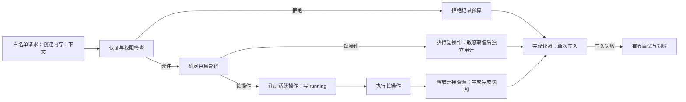

# 使用日志查看功能设计（v2）

状态：已按本方案实现日志采集、查询 API 和管理员日志页面，处于提交评审阶段。修订日期：2026-10-07。源码基线：`85847696bc6be022e072821715d3bf0925192370`（PR #46 合并后）。本文替代先前上传的设计稿，部署步骤见 [使用日志部署说明](usage-logs-deployment.zh-CN.md)。

## 1. 目标与交付范围

使用日志回答“谁在什么时间，对哪个资源做了什么，结果怎样”。第一版提供管理员可筛选的列表和按需详情，覆盖敏感信息查看、资源变更、单次 SSH 命令、服务转发和交互终端。

它是操作历史和排障入口；安全敏感操作的 `AuditEvent` 仍独立保存。两类记录允许因故障暂时不一致，使用日志不承担完整安全审计的保证。日志故障不改变已经完成的业务结果，丢失、降级和恢复必须可观测。

普通列表读取、监控采集、健康检查、静态文件及日志查询自身不采集。不保存命令、正文、输出、终端录屏或流分块；不引入模型、Token、费用、重试 attempt、导出系统或分布式消息队列。

本次交付覆盖身份基础、敏感操作与资源变更、exec、relay 和 terminal，以及管理员列表/详情；第 5 节白名单对应的所有操作均已接入。普通读取仍不进入使用日志。

## 2. 对现有代码的判断与设计决策

| 当前基础或缺口 | 新设计 |
| --- | --- |
| `AuditEvent` 只有用户、action、资源、地址和自由文本；repository 仅有 `Create` | 新建 `UsageLog`；原有安全审计写入独立保留 |
| 三个敏感信息 handler 成功取值后写审计，忽略写入失败 | 保留业务放行语义，增加安全告警、计数和有限幂等重试 |
| API Key adapter 将 `k.ID/k.Name` 写入 `Claims.UserID/Username`，Create 没有填 owner | 引入明确 Principal；Key 身份、owner 与操作对象分开 |
| scope 拒绝发生在 claims 注入前，未登记路由默认允许 API Key | 已验证身份先进入采集上下文；日志接口显式 JWT-only 且要求管理员 |
| request_id 使用私有 context key，错误响应使用字符串 key | 统一 `GetRequestID`，并校验外部 request_id |
| Logger writer 没有 Flush，WebSocket 升级可能直接写 hijacked connection | 统一 transport writer；握手成功由 terminal handler 显式报告 101 |
| relay 忽略 `io.Copy` 错误，terminal 部分 pump 错误最终仍返回 nil | 返回结构化传输/关闭结果，不能据 nil 或 HTTP 状态推断业务成功 |
| 前端自建 query 层没有取消、缓存移除和身份隔离能力 | 小幅补齐这些能力，继续沿用现有 API client、布局和中英 i18n |

保留 AxonHub 的时间/结果筛选、按需详情、keyset 分页和摘要保留分层思路。参考旧稿列出的请求列表、详情、存储策略和 request schema；具体实现以本版本的 Talus 语义为准，不依赖第三方 `unstable` 分支的最新行为。

## 3. 身份、权限与关联

`Principal` 至少包含 `auth_type`、真实 `user_id?`、`username?`、`api_key_id?`、Key 名称/前缀、role 和 ServerIDs。

- JWT 验证成功后填用户身份；API Key 验证成功后填 Key 身份，owner 有可信来源时另填 `user_id`。Key ID 不得再次映射成用户 ID。
- 新 Key 创建时从已验证 JWT 写入 owner；根据单用户升级策略，旧 Key 的 owner 为零或空时自动绑定默认管理员（未软删除且 role=admin 的最小用户 ID）。启动时执行幂等绑定；尚无管理员时不修改，首次初始化创建管理员的事务中补做。已有非零 owner 不覆盖，Key 内容和权限不改变。该绑定只影响 Key 当前归属与后续操作日志，不改写旧审计或使用日志。改动同步检查现有 server 访问判断与 reveal 限流，不把 Key owner 当作 Key 调用者本身。
- 验证成功后、scope/server 权限检查前填 Principal，因此拒绝也能归属已验证身份。无效凭据不解码成可信身份，记 `auth_type=unauthenticated`。
- 首版日志列表和详情均加入 `jwtOnlyRoutes`，handler 再要求 JWT Principal 且 `role=admin`。API Key 即使带 admin role 也不能查询。每次请求重新鉴权，cursor 不承担授权。
- `resource_id` 是操作对象，`api_key_id` 是调用身份。JWT 查看某个 Key 时只设置前者。

每次操作在服务端生成 UUID `operation_id`，用于写入、结束更新和重试去重；外部 request_id 仅用于关联，不能作为唯一键。request_id 接收长度 1–128、ASCII 字母/数字及 `._:-`，非法值重新生成，统一回传到响应与错误 envelope。

来源默认取 `RemoteAddr` 的 IP，去掉端口。仅在部署保证请求来自可信代理、且代理覆盖转发头时才解释 X-Forwarded-For；当前 `TRUST_PROXY` 布尔配置本身不能证明任意来访代理可信。未认证时不查询资源名称或 owner 来补身份。

## 4. 数据模型与不可变约束

`UsageLog` 使用独立模型，不继承 `BaseModel` 的软删除。用户、Key 和资源删除不级联删除历史，不依赖现存关联对象才能读取。

| 字段组 | 字段及约束 |
| --- | --- |
| 标识 | `id`：数据库递增主键；`operation_id`：非空唯一 UUID；`legacy_audit_event_id?`：非空值唯一 |
| 时间 | `started_at`、`finished_at?`、`duration_ms?`、`recorded_at`、`reconciled_at?`、`retention_at?` |
| 状态 | `outcome`、`phase`、`state_seq`：同一操作内递增，重试复用原值；`recovery_reason?` |
| 操作对象 | `action`、`resource_type`、`resource_id?`、`resource_name_snapshot?`、`server_id?` |
| 身份快照 | `auth_type`、`user_id?`、`username_snapshot?`、`api_key_id?`、Key 名称/短前缀快照 |
| 请求/来源 | `request_id?`、`method`、`route_pattern`、`http_status?`、`client_address?`、`source` |
| 业务结果 | `exit_code?`、`upstream_status?`、固定代码 `error_reason?`、版本化白名单 `metadata` |
| 追踪 owner | `owner_instance_id?`，长操作归属本次进程启动的实例 ID |

`source` 取 `operation/audit_legacy`。`outcome` 取 `running/succeeded/failed/rejected/cancelled/unknown`；`unknown` 可表示历史结果缺失或追踪中断，必须通过 source/recovery_reason 区分。

运行中 phase 为 `preparing/handshake/authenticated/ready`，界面分别显示“准备中/连接中/运行中”。已完成操作使用 `phase=closed`。追踪失联的 unknown 不证明底层业务已经结束，界面显示“状态未知（追踪中断）”。

`operation_id`、`started_at` 和已验证的身份类型不可被重试改变；资源名称等快照在获得事实后补充，正常终态后不再修改。耗时只在同一进程真实观察到结束时以单调时钟计算，数据库时间用于租约和清理。旧记录和失联记录不伪造 finished_at 或 duration。

正常终态不能被 phase 更新、重试旧快照或恢复任务覆盖。追踪恢复 unknown 可由原 owner 的更高 `state_seq`、真实完成快照精化；其中 owner_lease_expired 还允许按第 6.2 节恢复真实活跃状态。历史 unknown 永不走这些修正分支。序号只由本地操作锁内推进，全局恢复任务不推进 owner 的序号。

首批索引为 `(started_at,id)`、request_id、`(action,started_at,id)`、`(resource_type,resource_id,started_at,id)`、`(api_key_id,started_at,id)`、`(owner_instance_id,id) WHERE outcome='running'` 和终态清理所需 retention 索引。user/server/outcome 索引依据阶段验收的 EXPLAIN 增补。

新 `AuditEvent` 只增加可空、非空值唯一的 `operation_id`；旧记录保持 NULL。不将通用访问日志、HTTP 状态和命令内容塞入 AuditEvent。另建轻量 `usage_log_instances(instance_id,last_seen_at,lease_until,retired_at?)` 管理追踪存活和失效屏障；历史回填进度使用独立 `usage_log_backfill_state`，不复用只有完成标记的 ApplyOnce 当作可续跑任务。

## 5. 采集路径：先决定是否采集，再访问数据库

路由白名单在 Auth 前创建共享、可修改的内存操作上下文；Auth、handler、service 补充身份和业务事实。外层负责响应收尾。读取同一采集对象，不依赖外层读取内层 `r.WithContext` 才新增的值。



短操作（CRUD、reveal、主机信任、拒绝）结束后才写一条完整结果，不先插 running。创建成功后补新资源 ID；解析失败保留 action，资源 ID 留空。资源变更以实际提交结果为准，响应写入失败另列安全原因，不能把已生效的变更说成未执行。

长操作（exec、relay、terminal）通过认证及采集预算后，在业务开始前先注册到本实例活跃表，再 best-effort 插入 running。起始写失败仍继续业务；结束时允许按相同 operation_id 写入完整终态，不能因开始记录缺失而放弃结束记录。

浏览器 terminal 在首消息完成 JWT 验证前只保留内存上下文，不提前写 unauthenticated running。首消息无效/超时后，通过拒绝事件预算决定是否写一条 rejected；验证成功后补 Principal 并开始持久追踪。握手头预先验证的 API Key 走同样权限检查。

采集上下文由 mutex 保护，`Finish` 只生成一次真实完成快照。phase/结果按操作内序号写入；多个 goroutine 只能终结同一个 operation_id。业务连接 teardown 完成后才交给 recorder 写数据库，数据库等待不得占用 SSH pool 或 WebSocket 释放流程。

## 6. 写入预算、失败降级与恢复

以下是首版可配置的起始值，需通过压测验证并按部署资源调整；容量是采集限制，不是业务请求许可。

| 控制 | 起始值与行为 |
| --- | --- |
| 未认证拒绝采集 | 每 IP 每分钟 5 条、burst 5；进程全局每秒 10 条、burst 20 |
| 已认证新操作采集 | 进程全局每秒 50 条、burst 100；开始时决定，接受后的结束写入优先，重试仍受容量约束 |
| 普通 UsageLog DB 写入 | 最多 4 个并发、单次 deadline 200 ms；没有槽位时不无界等待 |
| 活跃追踪表 | 最多 4,096 项；满时跳过新追踪并计数，不写无法管理的 running |
| 完成重试 | 最多保留 2 分钟，退避约 1/2/4/8/15/30 秒并加抖动；最多 1,024 项/8 MiB |
| 实例续租/对账 | 每 10 秒续租、60 秒租约；每 30 秒、小批次最多 200 行对账 |

未认证预算和槽位判断必须发生在日志 INSERT 之前。IP 预算 Map 有最多 4,096 项、10 分钟过期和定期淘汰；满时仍受全局预算约束，不能通过新 IP 无限扩大内存。过量拒绝事件直接跳过并计数，首版不把聚合统计伪装成单条真实操作日志。

普通新记录、已接纳操作的完成写入、恢复/续租分别限额，完成写入优先于普通新记录。重试共用有界写入池；租约续租保留独立槽位。所有 UsageLog 与续租写入的并发总额不得超过共享数据库连接上限的 25%，给业务和安全审计留出连接容量。

安全 AuditEvent 使用独立并发槽位（起始值 1）、200 ms 单次截止和独立重试限额（最多 256 项/1 MiB/2 分钟），不能因 UsageLog 预算耗尽而跳过。超出自身限额仍告警、计数，保留原业务放行语义；不声称审计自身绝不丢失。

客户端取消后的写入使用独立、200 ms 截止的 context，不复用已取消请求。开始写入、结束写入和审计重试均以 operation_id 幂等；“已提交但调用方收到超时”不能产生第二条记录。终态快照固定真实起止时间，重试不重新计算业务耗时。

### 6.1 完成写入失败

1. 先释放业务资源，将活跃项标为 finishing 并生成不可变快照；同步结束尝试的在途状态仍受追踪，不能被对账认成失踪。
2. 失败后在同一锁内转入待完成表；有额度时完成该原子转移。容量溢出、过期或无法保留时明确放弃、计数并移除，随后允许对账修为未知。短操作直接使用同一快照/重试设施，因没有起始 running，不进入长操作孤儿对账。
3. 本实例对账数据库 running：不在活跃表、也不在待完成表，且超过 30 秒宽限的记录，条件更新为 `unknown/finalization_unavailable`，写 reconciled_at 与 retention_at。
4. 恢复 SQL 带 `outcome='running'` 条件，不能覆盖并发成功完成的结果。正在提交的完成快照仍在待完成表中；对账和队列淘汰需协调锁，避免把在途写入误判为失踪。

因此短暂 UPDATE 故障可恢复真实结果；预算耗尽后已有 running 最终变为可清理的未知记录。起始记录和结束记录都失败时，允许整条 UsageLog 丢失，必须有计数，不能承诺恢复不存在的数据。

### 6.2 实例失联与重启

每次进程启动生成新的 instance_id，重启不复用。实例注册确认成功且租约有效后才允许创建持久化长操作记录；注册失败时跳过长操作追踪并计数，不能插入找不到 owner 的 running。心跳只 UPDATE 已注册、未退休的实例，不 UPSERT 旧实例。用数据库时间续租，确认成功后才认为租约有效。

所有长操作的开始、修正和结束写入，都在短事务中先锁 instance 行并检查存在、未退休且租约有效，再锁/更新 UsageLog。正常写入可用 instance 的 FOR SHARE；恢复、续租后修正和清理采用 FOR UPDATE，并统一按 instance → UsageLog 顺序加锁，事务内以数据库当前时间重新判断资格，避免先检查失联、后错误修改已续租的会话。

全局对账只修复 owner 租约已失效的 running，不在启动时全表重置。正常代码不会删除仍被记录引用的非退休实例；若发现 owner 行异常缺失，将该 running 修为 unknown/owner_missing，原子设置 reconciled_at/retention_at 并告警，旧 owner 的后续写入仍因缺少实例而被拒绝。

首次修复原子写 `outcome=unknown`、`recovery_reason=owner_lease_expired`、reconciled_at 和 retention_at，后续扫描不重新计时。不填造真实关闭时间，不主动关闭业务连接。长终端超过保留天数，只要仍被活跃 owner 追踪，就仍是 running。

租约暂时失效而原 owner 仍存活时，成功续租后按本地状态修正：仍在 active 的 owner_lease_expired unknown，在操作锁内增加 state_seq，恢复 running/当前 phase，并清空 recovery_reason、reconciled_at、retention_at；pending/finishing 直接提交真实终态；两者皆无时改为 finalization_unavailable 并保留原保留起点。更高序号的真实终结事实优先，其他实例不替 owner 宣称重新运行或成功。旧序号更新不能覆盖已提交的真实终态。

若 owner_lease_expired unknown 已超过保留期，清理事务先锁 instance 并确认仍过期，将其 retired_at 一次设置为数据库当前时间，再删到期摘要。退休不可撤销，后续心跳和旧 operation 写入拒绝（owner_retired），防止旧终端很晚结束后用 upsert 复活已清理记录。返回的进程只能为后续新操作生成新 instance_id，旧操作不迁移；其实际结束可能不再进入使用日志，必须计数。清理完引用后可删除退休实例，因为缺失实例同样拒绝旧写入。

恢复、清理和真实结束使用上述统一锁顺序、条件更新和小批次 SKIP LOCKED；先按 instance 分组并锁 owner，再处理其记录，不能先锁日志再反向等待 owner。续租先胜出时清理跳过；退休先胜出时旧 owner 不再写。丢失数据库期间不宣称所有操作都在持续准确追踪，UI 明确展示追踪中断。

### 6.3 可观测性与容量

至少提供低基数计数：`usage_capture_skipped_total`（预算/容量）、`usage_write_failed_total`、`usage_finalization_retry_total`、`usage_reconciled_total`、`audit_write_failed_total`，以及当前活跃数、待重试项数/字节数和最老待完成年龄。

告警仅含操作 ID、action、固定故障代码和重试计数，不输出 SQL 参数、raw err.Error()、URL、secret 或请求正文。告警本身需限频。各进程预算按实例数累加，新增副本前重新核算数据库总写入和连接上限；这些本地限额不被称为集群全局限额。

## 7. 安全审计双写与历史迁移

### 7.1 新敏感操作：审计优先、事务独立

成功获取凭据/API Key/服务敏感信息后，在发送结果前独立、幂等写 AuditEvent，operation_id 与本次操作相同。该事务只涉及安全审计；随后 UsageLog 的写入、关联或约束失败不得回滚 AuditEvent。

AuditEvent 自身失败仍保留现有业务放行语义，同时告警并使用独立的有限重试额度；唯一 operation_id 处理提交结果不明确。审计重试队列只保存安全字段，绝不保留已解密值。业务结束后再 best-effort 写 UsageLog，两表通过 operation_id 关联；不要求它们同时存在。

新记录不由历史回填器补录。审计成功但 UsageLog 最终丢失时，安全审计原表仍保留，使用日志页面可能缺少摘要；这是明确的降级边界，计数不能被静默吞掉。未来若要求所有安全审计均进入列表，再单独设计持久投影恢复，首版不暗含该保证。

### 7.2 旧审计：封闭集合、分批回填

只回填 `AuditEvent.operation_id IS NULL` 的旧事件，映射原 created_at 为 started_at，source 为 audit_legacy，结果为 unknown。身份来源、HTTP 状态、耗时和 request_id 没有可靠依据时保持未知/空；不默认复制旧 Details。

operation_id 使用固定命名空间与 AuditEvent ID 确定性生成，`legacy_audit_event_id` 非空唯一。回填冲突跳过，usage_log_backfill_state 持久化迁移 ID、检查点、最终水位、完成时间及计数。单个检查点只是续跑位置，不能代替最终查漏。

同一迁移只允许一个执行者：专用数据库连接持有 session advisory lock，取得后重新检查 complete，再分批提交；所有批次和 complete 写入都使用持锁的同一专用连接，不为整个回填持有长事务。记录 complete 是此任务最后一次写操作，之后不再 INSERT。连接/锁丢失即停止任务；重新取得锁后再检查状态，不能让已启动的第二个 worker 在清理后继续补录。

发布顺序：先加兼容字段/索引；停止并排空所有旧版本审计写入者及未提交事务；启用全部新写入者（每个新事件都有 operation_id）；确定旧集合最终水位后分批回填，再对最终集合做完整查漏，最后记录 complete。首版采用协调切换，不承诺旧/新写入者无限期混用。

PostgreSQL 的小 ID 可以晚提交，因此最终查漏不能只查询 `id > 上次检查点`。迁移期间暂停 audit_legacy 摘要清理；complete 持久化后才启用该来源的保留任务。已 complete 的迁移再次执行直接退出，清理后的旧 UsageLog 不再被原审计表复活。

原 AuditEvent 不因回填或首版摘要清理而删除。超过摘要保留期的历史行可以按明确策略被清理，页面不把摘要保留范围冒充原审计表的全部历史。

## 8. 列表 API 与近似一致性分页

新增 `GET /api/v1/usage-logs` 和 `GET /api/v1/usage-logs/{id}`，沿用 `{data:...}` envelope 和结构化错误。支持时间、action、outcome、auth_type、user_id、api_key_id、resource/server ID 和完整 request_id 精确筛选，不提供任意正文/metadata 全文检索。

筛选候选通过 `GET /api/v1/usage-logs/filter-options?kind=server|user|api_key&q=<名称或ID>` 按需查询，权限同为 JWT 管理员。响应包含 `items:[{id,name,prefix?,deleted}]` 和 `has_more`；ID 使用十进制字符串，每次最多 50 条。搜索按名称、用户名或 Key 前缀作字面匹配，正整数额外匹配并优先返回精确 ID；查询有独立超时。仅投影显示所需字段，不读取密码、Key 原文/散列或 SSH 凭据。候选来自实体表，服务器和用户包含软删除记录；API Key 硬删除后不再出现在候选中。此接口不扫描日志历史，不表示当前时间范围内有匹配日志。

默认最近 24 小时，提供 1 小时、7 天和自定义范围；单次跨度最多 90 天。时间采用 UTC `[from,to)`，页面按用户时区展示。每页默认 25 条，可选 50/100，后端最多 100。

### 8.1 固定查询条件与游标

首次进入或显式刷新时，将相对预设一次解析成具体 UTC from/to；API 省略时间时也仅在无 cursor 的首次请求求默认值，并在响应 query 返回全部已应用的规范化筛选（不限于时间和页大小）。翻页复用这些值，不再次计算 now。

后续请求形式为 `GET /api/v1/usage-logs?from=<query.from>&to=<query.to>&page_size=<query.page_size>&<其他规范化筛选>&cursor=<next_cursor>`。服务端先解 cursor，再与请求的全部条件比较；缺必需条件就返回失配错误，不能重新求默认时间。上界只信任签名 cursor 中的值，不接受裸 id_upper_bound 作为另一个分页入口。

首次在一个短只读 REPEATABLE READ 事务内读取当前最大可见 ID 与第一页，然后立即提交。响应字段叫 `id_upper_bound`，不是 snapshot_id；后续每页独立查询，不保持跨请求数据库事务。

```sql
WHERE started_at >= :from AND started_at < :to
  AND id <= :id_upper_bound
  -- 仅后续页加这一条件
  AND (started_at, id) < (:last_started_at, :last_id)
  -- 所有业务筛选均参数化
ORDER BY started_at DESC, id DESC
LIMIT :page_size_plus_one;
```

取 page_size+1 判断 has_more，下一 cursor 的位置来自实际返回的最后一行，不使用被截掉的探测行。空表上界为 0。首版不计算全量 total，不支持任意页码跳转。

cursor 经 HMAC 签名，包含协议版本、查看者用户 ID、规范化筛选摘要、from/to、页大小、ID 上界、最后排序位置和固定到期时间（首次建立后 30 分钟，翻页不延长）。可使用从 JWTSecret 以独立用途派生的签名密钥，密钥轮换使旧 cursor 失效。

服务端校验签名、查看者、条件、范围、页大小和精度；非法/失配/过期分别返回 `invalid_cursor/cursor_filter_mismatch/cursor_expired`。过期不默默跳回第一页。时间保留数据库微秒精度，cursor 位置不能经过 JS Date 毫秒截断；UsageLog ID 和上界按十进制字符串传输，避免 JS 大整数精度丢失。

```json
{
  "data": {
    "items": [{"id":"123","operation_id":"9ee6f4b0-4c6d-4f5d-bb33-25c5069dbb58","action":"server.exec","outcome":"failed","http_status":200,"exit_code":1}],
    "query": {"from":"2026-10-05T06:00:00Z","to":"2026-10-06T06:00:00Z","page_size":25},
    "id_upper_bound":"456",
    "next_cursor":"signed-opaque-token",
    "has_more":true,
    "consistency":"bounded_keyset"
  }
}
```

### 8.2 一致性承诺和边界

仅承诺：排序键不变时，同一前进游标链不重复返回已经读过的 ID；新生成的更大 ID 不插入当前链。ID 上界不能固定提交可见性：事务 A 取得 100 未提交，B 的 101 提交，首次上界为 101；A 晚提交仍可能进入未读页，或因排序位置已越过而直到刷新才可见。

运行中结果变化会使尚未读取的行进入/退出 outcome 筛选；保留清理也会造成未读页缺项。仍在缓存中的已访问页原样恢复，当前页的行和顺序保留到显式刷新。淘汰页重读的变化及下游页栈截断按第 9 节处理。详情看到状态变化时标记“状态已变化，刷新列表”，不自动删除当前行。

不承诺整个结果集合固定或阅读期间完整无遗漏。若未来必须固定集合，需要物化 ID 清单、TTL、容量上限和服务器查询会话，另行评估；MVP 不建设这套机制。

### 8.3 首页更新提示

自动检查默认关闭。开启后，仅可见的第一页每 15 秒独立请求新的第一页，不携带当前 ID 上界。自定义范围复用固定 from/to；相对预设在检查时求候选新范围，但不改当前列表条件。

比较首页有序 ID 和用户可见持久字段的稳定摘要，变化后锁存“首页有更新，刷新”。摘要排除请求生成时间、租约/心跳、通用 updated_at 和随 now 增长的运行耗时；不能只比较 MAX(id)。每个查询会话只保留一个稳定 probe key 的候选结果，动态 from/to 在发起检查时求值，不按每次时刻积累缓存；探测绝不覆盖当前页面缓存。

此提示能发现首页的晚提交、终态变化和进出筛选，不保证检测更深位置的晚提交，也不提供准确“新增 N 条”。点击刷新才建立新范围/上界、清空页栈并回第一页。

## 9. 页面、详情与查询缓存

侧栏入口为“使用日志”，路径 `/usage-logs`，只对 JWT 管理员显示；后端鉴权仍是权限依据。桌面表格、移动紧凑行包含时间、操作、身份来源/操作者、资源快照、结果、耗时和 request_id。删除后的资源保留快照，跳转不可用时明确说明。

服务器、用户和 API Key 提供可搜索选择，显示名称和 ID，Key 另显示前缀，软删除项标记“已删除”。选中后保存 ID 筛选，实体 ID 校验 PostgreSQL bigint 上界且避免经过 JavaScript Number，支持清除和 URL 恢复；候选截断时提示继续搜索，加载失败可重试。找不到的历史实体或已撤销 Key 可手动输入正整数 ID，列表仍按日志中的原始 ID 精确查询。候选搜索请求在查询变化、关闭控件或认证会话变化时取消，旧响应不能恢复候选。`request_id` 输入旁说明其为 HTTP 请求关联编号，用于排错；外部合法值可复用，不能作为资源 ID、日志 ID 或去重凭据。

详情抽屉支持 `/usage-logs?detail=<id>`，关闭保留当前条件、页栈和滚动位置。显示完整关联 ID、真实起止时间、身份/资源快照、地址、HTTP/上游状态/exit_code、安全原因及已采集的生命周期信息。旧记录显示“旧审计记录”；缺失字段显示“未知/未采集”，不显示正文查看入口。

运行中详情在抽屉打开且页面可见时每 2 秒刷新，终态、关闭、切换详情或页面不可见时停止；连续失败退避至最多 30 秒并显示错误。恢复 unknown 提示“追踪中断，实际结束时间未知”，停止常规 running 轮询；用户可手动刷新以查看 owner 后续修正。

列表初次加载骨架；换页成功前保留上一页并标记加载，不能让旧页行看起来属于新筛选；错误保留原页并提供重试。cursor 过期保留当前页、明确要求刷新。列表页使用冻结页存储，或 staleTime=Infinity 并禁用自动失效重取/轮询，不能因默认 30 秒过期而在返回上一页时重读。URL 仅保存非敏感筛选和 detail ID，签名 cursor 与页缓存留在本次页面会话中。

在继续使用自建 query 层前补齐以下能力，保持旧零参数 queryFn 兼容：

- `queryFn({signal})` 的 controller 和 request generation 由缓存 Entry 管理。AbortError 不重试、不显示为业务错误；所有成功、失败和 finally 更新均检查 generation。
- 同 key 最后一个订阅者离开时才取消，不让一个组件取消其他订阅者的请求。取消后无数据恢复 idle，有数据保留已有 success；相同 key 重新进入可以发起新请求，不能复用已取消的 inFlight。
- 列表 key 使用 `usage-logs + auth_epoch + query_session_id + canonical_filters + cursor`；上界已包含在 cursor，首次 key 不因响应带回上界再变化。显式刷新或新筛选生成新的本地 query_session_id。详情另用 `usage-log + auth_epoch + id`，探测单独 key。JWT 原值不进入 key。
- 建立响应式 auth store：设置/清除 token、跨标签 storage 事件和到期 timer 更新 auth_epoch。检测到退出、身份变化或本会话日志 401/403 时，取消并移除全部日志缓存、抽屉、页栈和候选首页，立即清 UI；enabled=false 不能替代清理。认证未恢复完成前不展示缓存。
- API client 的认证副作用也检查发起请求时的 auth_epoch；旧账号请求晚到的 401/403 不能清掉新登录 token、跳转新会话或擦除其缓存。当前后端验证 JWT 中的 role，不承诺数据库角色变更立即撤销旧 token；这里的及时清理指检测到本地认证变化或认证响应时。
- 单会话最多缓存 20 页（第一页和当前页固定保留，其余 LRU）与 50 个详情。淘汰页重读使用原进入 cursor、原条件和同一上界，明确提示可能已变化；成员或下一 cursor 变化时，废弃该页之后的页栈及缓存，从新末行继续翻页，不能接上旧下游页制造重复 ID。
- 10 分钟淘汰针对无订阅、无人阅读的数据，不清正在阅读的当前页/首页；页面查询会话销毁后，返回建立新会话。旧页的 cursor 历史最多保留 100 个（当前前进路径），超限提示先刷新以继续浏览，避免只限制行缓存却无限保存页栈。

## 10. exec、relay 与 terminal 的业务事实

| action | 结果定义与安全元数据 |
| --- | --- |
| `{resource}.create/update/delete` | 以实际业务提交为准；记录对象、新 ID 和固定错误 reason；API Key 没有 update 路由，不预设不存在的 action |
| `credential.reveal/api_key.reveal/service.credentials` | 独立安全审计保留；使用日志记录业务和拒绝结果，不记录取出的敏感值 |
| `server.host_key.trust` | 信任决策成功/失败及固定 reason，不保存凭据 |
| `server.exec` | exit_code=0 为 succeeded，非零 failed；SSH 建连/超时失败 exit_code 为空；真实客户端取消为 cancelled |
| `service.relay` | 上游 4xx/5xx、网络或复制错误为 failed，真实取消为 cancelled；保存独立 upstream_status 与 bytes_copied |
| `server.terminal` | ready 后运行中；正常关闭 succeeded（显示“已关闭”），认证/权限拒绝 rejected，SSH/异常传输 failed，真实取消 cancelled |

exec 退出码 1 且 HTTP 200 应显示“命令失败，退出码 1，HTTP 200”。不能统一按 HTTP 200 判成功；取消也不能只凭某个 teardown 中派生 context 的 canceled 判定。

当前 SSH 执行的 runCommand 使用 background context 派生超时，不能感知原请求取消。B 阶段须将请求 context 传入，区分客户端取消与执行超时，关闭/回收 SSH session 和执行 goroutine 后才 Finish。仅客户端请求断开但命令仍继续/完成时，不能编造 cancelled；也不把传输取消说成远端命令副作用已撤销。

relay 返回结构化 upstream method/status、复制字节数和复制错误；耗时到复制结束/断连。保持直接转发与 backpressure，不完整缓冲；已发出最终响应头后不能再追加 JSON 错误。安全路径标识使用内部路由模板/已配置标签，没有可信模板时为空，禁止把用户提供路径或替换前路径简单删 query 后当作安全路径。

terminal 保持首消息 10 秒认证期限，记录 handshake/authenticated/ready/closed 时间和固定原因，不采集 auth/input/output/resize 内容。`StartSession` 返回结构化首个结束原因，区分导致关闭的原始事件和 teardown 引起的连带错误；多个 pump 的关闭不能重复记录或把干净关闭误判为取消。

writer 只暴露底层实际支持的 Flusher/Hijacker/Unwrap 等能力，统一处理隐式 200、多个信息性 1xx 与首个最终状态；101 属于升级成功，由成功 Upgrade 回调明确记录。升级失败保留真正已发送的状态，不能在库已经发送错误后再覆盖。HTTP 握手时间和会话时间分别记录。

## 11. 内容限制和保留策略

不保存 JWT、API Key 原值/哈希、密码、私钥、凭据、Authorization/Cookie、命令、stdout/stderr、请求/响应正文、终端输入输出或流分块。

metadata 采用版本化白名单，总量最多 4 KiB，仅接收 timeout_seconds、exit_code、受限 method/status、bytes_copied、关闭原因和生命周期时间。error_reason/recovery_reason 使用固定代码，不复制原始错误或任意 AppError params。资源/身份名称按有界快照保存（每项最多 256 字节，移除控制字符），作为非可信文本转义显示；字段允许保存不等于任意文本已经脱敏。

普通摘要保留 30 天，reveal/删除/主机信任摘要 90 天。按 action 分类、小批次物理删除，不能以 `finished_at IS NOT NULL` 判断可清理：

| 记录 | retention_at 与清理资格 |
| --- | --- |
| 真实结束 | retention_at=finished_at；非 running 且达到保留期 |
| 本地结束写入已丢失 | retention_at=reconciled_at；unknown/finalization_unavailable 达到保留期 |
| owner 失联 | retention_at=reconciled_at；事务内复核租约，先按第 6.2 节退休仍失联的 owner 再清理；owner_missing 也按同期限清理 |
| 旧审计 | retention_at=原 created_at；迁移 complete 后才清理，finished_at 可以一直为空 |
| running | retention_at 为空，保留；先由恢复机制确认追踪失联，不能单凭 started_at 很旧删除 |

恢复 unknown 的保留期不通过重复扫描重新计时。按 instance → UsageLog 的事务锁顺序，健康 owner 先修正其 unknown，清理跳过；真实完成设置实际保留起点。退休/缺失 owner 永不重建旧操作。普通重试提交前检查固定快照的保留期限，已过期真实终态快照不重新插入；旧迁移 complete 后禁止回填。原 AuditEvent 不受摘要清理影响。

首版保留天数、预算和定时任务通过服务端配置提供，非法配置启动时拒绝或使用明确默认值。首次启用清理前报告按来源/action/终态将清理的数量；不建设存储管理页面。

## 12. 分阶段实现与验收

| 阶段 | 可交付内容 | 放行条件 |
| --- | --- | --- |
| A：基础与短操作 | Principal/owner/request_id；模型/索引；不可变完成快照/有界重试；独立审计、旧回填；预算；取消/缓存隔离；管理员列表/详情；reveal、CRUD、主机信任 | 权限、幂等、审计降级、查询、迁移、保留验收通过；页面标明已接入范围 |
| B：exec | 活跃追踪、实例注册/租约/退休、恢复对账；SSH 请求取消与超时改造；exec 结果与退出码 | UPDATE 故障能重试或变 unknown；长操作没有永久幽灵 running |
| C：relay/terminal | writer 修复、结构化复制/关闭结果、生命周期事实 | WebSocket、正常关闭、异常断连、流式传输与资源释放回归通过 |

每阶段单独 PR，设计稿不被描述为已实现功能。后续再按实际需求评估持久化无损采集、固定结果集合、attempt 时间线、自动化查询权限、配置页面或导出。

验收矩阵：

| 场景 | 必须满足 |
| --- | --- |
| JWT/Key 名称和 ID 相同、旧 Key owner 未知 | 身份类型不混淆，不猜用户归属；操作对象与调用 Key 分开 |
| 非管理员 JWT、API Key、未认证查询日志 | 403/401；所有新增路由通过 scope 覆盖检查 |
| UsageLog 失败而 AuditEvent 成功 | 审计不回滚；有降级计数；没有敏感告警内容 |
| 两类写入已经提交但返回超时 | 同 operation_id 重试仍分别至多一条 |
| 起始 INSERT 失败、结束成功 | 至多一条完整终态，不丢掉已知结束事实 |
| 最终 UPDATE 临时失败/重试额度耗尽 | 分别恢复真实结果/对账成未知，不永久 running，不持续 2 秒轮询 |
| 一个实例重启、另一个长终端仍活跃 | 不全表恢复，不误伤其他 owner；未知不伪造关闭和耗时 |
| owner 暂时失联后回来、真实完成与恢复竞争 | 原 owner 的高序号事实优先；正常终态不倒退 |
| 活跃 owner 续租、退休 owner 很晚返回、实例注册失败 | 前者恢复 running 并清空保留起点；后者不复活被清理旧操作；注册失败不留无 owner 的 running |
| 未认证 exec/relay 高频请求与随机 IP | INSERT 前受预算限制，Map/队列/并发有界；业务与审计不会被普通日志槽位占满 |
| 相同 started_at、多页新增、高位先提交/低位晚提交 | 顺序与前进链无重复；遗漏边界符合文档；首页提示不只比较 MAX(id) |
| 相对时间翻页、筛选/页大小切换、cursor 过期 | from/to 冻结；失配/过期明确失败；保留原页，不无提示跳页 |
| outcome 变化、清理删除、首页探测 | 当前/缓存页不跳动；淘汰页重读变化会截断下游栈；不承诺固定全集或准确新增数 |
| 超过 20 页、30 秒后返回上一页、游标篡改/查看者失配 | 缓存页仍冻结；淘汰页按原 cursor 重读且不接旧后续页；非法游标拒绝 |
| 自定义/相对首页探测、单纯 heartbeat | 自定义范围不变、相对候选滚动但列表不动；心跳不误报首页更新 |
| 取消后同 key 重入、旧请求晚到、同 key 双订阅 | 无取消重试/旧结果覆盖；单方离开不取消另一方 |
| 跨标签退出、后台 token 到期、换账号、旧 401 晚到、快速切详情 | 清空检测到失效的会话 UI/缓存；旧响应不影响新登录；错误可重试，终态停止轮询 |
| 并发回填、重跑、小 ID 晚提交、清理后再启动 | 单执行者及最终查漏完整；complete 后不重复/复活；旧 AuditEvent 不删除 |
| 历史/恢复 unknown 无 finished_at、健康长期 running | 前者按 retention_at 可清理，后者不因年龄删除 |
| exec 非零且 HTTP 200、SSH 超时/取消 | 分别记录真实退出码/固定原因，不按 HTTP 或 teardown canceled 猜结果 |
| relay 上游 4xx/5xx、复制中断、已写头后出错 | 独立状态/字节数与结果；不追加 JSON、不缓冲正文、不破坏 streaming |
| writer 的 103→200、重复最终 WriteHeader、隐式 200、成功/失败 Upgrade | 信息性状态不取代最终状态；记录真实首个最终状态及成功握手 101 |
| terminal 无效/超时首消息、SSH 失败、干净关闭、异常断连 | 每操作至多一条；首个原始关闭原因明确；连接释放和 grace timeout 不被日志延长 |
| 带标记 secret、URL query/path、命令和输出 | 新表/API/新增告警不出现受禁内容；任意路径不冒充安全模板 |
| 页大小边界、最长范围、索引与容量 | 后端限制有效；EXPLAIN/故障注入/压测达到部署约定指标 |
